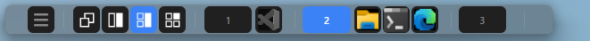

# 🪟 tile_wm



**tile_wm** は、Windows 11 向けのカスタムトップタスクバーアプリケーションです。  
仮想デスクトップの直感的な切り替えと、ウィンドウの自動タイリングをシンプルな UI で提供します。

[Tauri v2](https://v2.tauri.app/)（Rust + Web フロントエンド）で構築されており、軽量で高性能です。

---

## 目次

- [主な機能](#主な機能)
  - [🖥️ 仮想デスクトップ管理](#️-仮想デスクトップ管理)
  - [📐 ウィンドウタイリング](#-ウィンドウタイリング)
  - [🔄 レイアウトサイクル / フリップ](#-レイアウトサイクル--フリップ)
  - [📌 フロートモード](#-フロートモード)
  - [🎯 ウィンドウのドラッグ＆ドロップ（仮想デスクトップ間移動）](#-ウィンドウのドラッグドロップ仮想デスクトップ間移動)
  - [⌨️ ホットキー](#️-ホットキー)
  - [📋 ポップアップメニュー](#-ポップアップメニュー)
  - [⚙️ 設定ファイル](#️-設定ファイル)
- [必要要件](#必要要件)
- [ビルドと実行](#ビルドと実行)
  - [開発モード](#開発モード)
  - [プロダクションビルド](#プロダクションビルド)
- [設定](#設定)
  - [設定項目一覧](#設定項目一覧)
  - [設定例](#設定例)
- [プロジェクト構成](#プロジェクト構成)
- [使用技術](#使用技術)
- [ライセンス](#ライセンス)

---

## 主な機能

### 🖥️ 仮想デスクトップ管理

- タスクバー上のボタンで仮想デスクトップをワンクリック切り替え
- Windows 標準の `Ctrl+Win+←/→` による切り替えにもリアルタイムで追従
- レジストリ（`HKCU\SOFTWARE\Microsoft\Windows\CurrentVersion\Explorer\VirtualDesktops`）を監視し、現在のデスクトップ番号を正確に取得
- 各デスクトップごとに独立したタイリングモードを保持

### 📐 ウィンドウタイリング

アクティブな仮想デスクトップ上のウィンドウを、選択したレイアウトに自動整列します。

| モード | アイコン | レイアウト |
|--------|----------|-----------|
| **Float** | 🆓 | タイリングなし（自由配置） |
| **2Win** | 2️⃣ | 左右 2 分割（左メイン＋右）↔（右メイン＋左） |
| **3Win** | 3️⃣ | 左メイン + 右上 + 右下 ↕ 右メイン + 左上 + 左下 |
| **4Win** | 4️⃣ | 2×2 グリッド（メイン領域の位置を切り替え可能） |

- メインウィンドウを基準に、サブウィンドウが自動配置されます
- ウィンドウの増減を自動検出し、タイリングを再適用（デバウンス処理付き）
- タイリング対象から除外するウィンドウタイトル・プロセス名を設定可能

### 🔄 レイアウトサイクル / フリップ

- **サイクル**: 同じタイリングモードをもう一度クリックすると、メイン領域の位置が左右/上下に入れ替わります（例: 左メイン→右メイン）
- **フリップ**: `Ctrl` を押しながら 2Win/3Win/4Win ボタンをクリックすると、`flip_main` 設定がトグルされ、すべてのデスクトップのメイン領域の向きが反転します

### 📌 フロートモード

- Float モード時にタスクバーの **メニューボタン（⋮）** をドラッグすることで、タスクバー自体を画面上の任意の位置に移動可能
- フロート位置は設定ファイルに自動保存され、次回起動時に復元されます
- フロート中はウィンドウリストとデスクトップ切り替え機能もそのまま利用可能

### 🎯 ウィンドウのドラッグ＆ドロップ（仮想デスクトップ間移動）

- タスクバー上のアプリアイコンを別のデスクトップボタンにドラッグ＆ドロップすると、そのウィンドウを移動先の仮想デスクトップに移動できます
- 移動先のデスクトップに自動で切り替わり、移動したウィンドウにフォーカスが当たります

### ⌨️ ホットキー

低レベルキーボードフック（`WH_KEYBOARD_LL`）を使用し、以下のホットキーをアプリ横断で提供します：

| ホットキー | 機能 |
|-----------|------|
| `Ctrl + Alt + Win + F12` | フォアグラウンドウィンドウを右隣のデスクトップに移動 |
| `Ctrl + Alt + Win + F11` | フォアグラウンドウィンドウを左隣のデスクトップに移動 |

移動後、移動先のデスクトップに自動で切り替わり、移動したウィンドウにフォーカスが戻ります。

### 📋 ポップアップメニュー

タスクバー左端のメニューボタン（⋮）をクリックすると表示されるコンテキストメニュー：

- **📝 Edit config.toml** — 設定ファイルを規定のエディタで開く
- **❓ Help** — バージョン情報と簡単な使い方を表示
- **Close menu** — メニューを閉じる
- **Exit** — アプリケーションを終了

メニューは `Escape` キー、またはフォーカス喪失時に自動で閉じます。

### ⚙️ 設定ファイル

- `%LOCALAPPDATA%\tile_wm\config.toml` に自動生成
- 外観（色・サイズ）、タイリングパラメータ、スペーシングなどを TOML 形式で設定可能
- 設定変更はメニューから直接ファイルを編集するか、アプリの設定 UI から即時反映

---

## 必要要件

| 項目 | バージョン / 要件 |
|------|------------------|
| **OS** | Windows 11 |
| **Rust** | 2021 Edition 以降（[rustup](https://rustup.rs/) でインストール） |
| **Node.js** | 18 以降（[Node.js](https://nodejs.org/)） |
| **npm** | 9 以降 |

---

## ビルドと実行

### 開発モード

```bash
# リポジトリをクローン
git clone https://github.com/yourusername/tile_wm.git
cd tile_wm

# フロントエンド依存関係をインストール
npm install

# 開発サーバー起動（ホットリロード付き Tauri デスクトップアプリ）
npm run tauri dev
```

### プロダクションビルド

```bash
# フロントエンドをビルドし、Rust バイナリをコンパイル
npm run tauri build
```

実行ファイルは `src-tauri/target/release/tile_wm.exe` に生成されます。

> **注意**: 初回ビルド時は Tauri のシステム依存関係のインストールが必要な場合があります。詳細は [Tauri v2 公式ドキュメント](https://v2.tauri.app/start/prerequisites/) を参照してください。

---

## 設定

設定ファイルは初回起動時に `%LOCALAPPDATA%\tile_wm\config.toml` に自動生成されます。
メニューの **📝 Edit config.toml** からも直接開くことができます。

### 設定項目一覧

| キー | 型 | デフォルト | 説明 |
|------|-----|-----------|------|
| `bar_height` | 整数 | `40` | タスクバーの高さ（ピクセル） |
| `split_ratio_x` | 整数 | `50` | 水平方向の分割比率（%） |
| `split_ratio_y` | 整数 | `50` | 垂直方向の分割比率（%） |
| `exclude_titles` | 文字列配列 | `[]` | タイリングから除外するウィンドウタイトルの部分一致リスト |
| `exclude_processes` | 文字列配列 | `["tile_wm.exe"]` | タイリングから除外するプロセス名リスト |
| `window_x` | 整数 | `100` | タスクバーウィンドウの X 座標（フロート位置） |
| `window_y` | 整数 | `100` | タスクバーウィンドウの Y 座標（フロート位置） |
| `window_bg_rgba` | 整数配列 | `[32, 32, 32, 255]` | タスクバー背景色 (RGBA) |
| `button_fg_rgb` | 整数配列 | `[136, 136, 136]` | ボタンの文字色 (RGB) |
| `button_bg_rgb` | 整数配列 | `[32, 32, 32]` | ボタンの背景色 (RGB) |
| `button_highlight_fg_rgb` | 整数配列 | `[255, 255, 255]` | ボタンホバー時の文字色 (RGB) |
| `button_highlight_bg_rgb` | 整数配列 | `[255, 255, 255]` | ボタンホバー時の背景色 (RGB) |
| `flip_main` | 真理値 | `false` | タイリング時のメイン領域の向きを反転 |
| `min_window_height` | 整数 | `220` | タイリング時の最小ウィンドウ高さ（ピクセル） |
| `top_spacing` | 整数 | `40` | 画面上部の余白（タスクバー分） |
| `bottom_spacing` | 整数 | `10` | 画面下部の余白 |
| `left_spacing` | 整数 | `10` | 画面左端の余白 |
| `right_spacing` | 整数 | `10` | 画面右端の余白 |
| `inner_spacing` | 整数 | `10` | タイリング時のウィンドウ間の余白 |

> **補足**: 設定ファイル内のキー名はスネークケース（`snake_case`）で記述してください。

### 設定例

```toml
bar_height = 36
split_ratio_x = 60
split_ratio_y = 50
exclude_titles = ["Calculator", "Settings"]
exclude_processes = ["tile_wm.exe"]
window_x = 200
window_y = 50
window_bg_rgba = [48, 48, 48, 255]
button_fg_rgb = [180, 180, 180]
button_bg_rgb = [48, 48, 48]
button_highlight_fg_rgb = [255, 255, 255]
button_highlight_bg_rgb = [64, 120, 242]
flip_main = false
min_window_height = 220
top_spacing = 40
bottom_spacing = 10
left_spacing = 10
right_spacing = 10
inner_spacing = 6
```

---

## プロジェクト構成

```
tile_wm/
├── index.html                  # メインウィンドウ（タスクバー）の HTML
├── menu.html                   # ポップアップメニューの HTML
├── package.json                # フロントエンド依存関係
├── vite.config.ts              # Vite ビルド設定
├── specification.md            # 設計仕様書
├── sample_taskbar.png          # スクリーンショット
├── public/
│   └── icons/                  # タイリングモードアイコン
│       ├── float.png
│       ├── 2Win.png / 2Win-R.png
│       ├── 3Win.png / 3Win-R.png
│       └── 4Win.png / 4Win-R.png
├── src/                        # フロントエンド（JavaScript / CSS）
│   ├── main.js                 # メインウィンドウのロジック
│   ├── menu.js                 # ポップアップメニューのロジック
│   ├── styles.css              # タスクバーのスタイル
│   └── menu.css                # メニューのスタイル
└── src-tauri/                  # Rust バックエンド
    ├── Cargo.toml              # Rust 依存関係
    ├── tauri.conf.json         # Tauri 設定
    ├── icons/                  # アプリアイコン
    └── src/
        ├── main.rs             # エントリポイント
        ├── lib.rs              # アプリ初期化・モジュール管理
        ├── config.rs           # 設定ファイルの読み書き
        ├── app_bar.rs          # Windows AppBar 登録・ウィンドウ配置
        ├── desktop.rs          # 仮想デスクトップ管理（レジストリ / COM / winvd）
        ├── tiling.rs           # タイリングレイアウト計算エンジン
        ├── commands.rs         # Tauri IPC コマンド（フロントエンド↔バックエンド）
        ├── hotkey.rs           # グローバルホットキー（WH_KEYBOARD_LL）
        └── win_event.rs        # ウィンドウ増減検出・自動タイリング
```

---

## 使用技術

| カテゴリ | 技術 |
|---------|------|
| **フロントエンド** | [Vite](https://vitejs.dev/) + Vanilla JS + CSS |
| **デスクトップフレームワーク** | [Tauri v2](https://v2.tauri.app/) |
| **バックエンド** | [Rust](https://www.rust-lang.org/) 2021 Edition |
| **Windows API** | [windows-rs](https://github.com/microsoft/windows-rs) 0.58 |
| **シリアライゼーション** | [serde](https://serde.rs/) / [toml](https://github.com/toml-rs/toml) |
| **仮想デスクトップ API** | [winvd](https://crates.io/crates/winvd) 0.0.49 |
| **ロギング** | [log](https://crates.io/crates/log) |

---

## ライセンス

[MIT](./LICENSE)

---

> **tile_wm** — Windows 11 のデスクトップ管理を、より快適に。